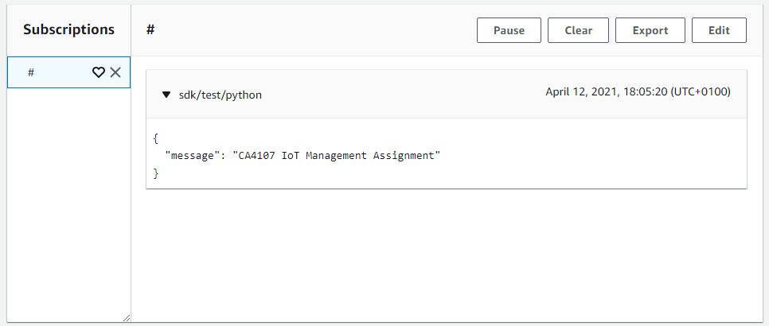

<h1> 
 CA4017 - IoT Management Assignment 
 </h1>

  

<h2> Project Description </h2>

 The aim of this assignment was to connect an IoT device to AWS IoT Core using their connection kit. This can then enable you to subscribe to topics in order to view messages being sent by your IoT devices. You can also use the AWS IoT Core Console in order to publish messages to your devices. 

  

 We decided to also create prototypes for a potential mobile / web application which could be used to manage your IoT devices, their settings, and the access to these devices all in one place. This could be developed using the AWSIoTSDK for Python possibly with the use of Flask, HTML, CSS, and Javascript. 

  

<h2> YouTube Video Demo </h2>
Add Link Here

<h2> Group Members </h2>

 Michael Walsh - 17428926 

 Karl Hannigan - 17435332 

 Adrian Lackey - 17466892 

